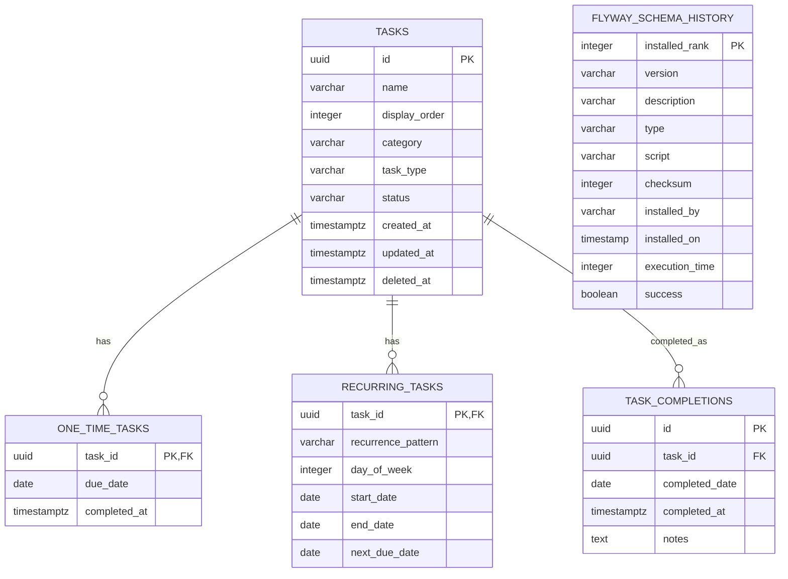

# Database Documentation

**Generated**: 2025-09-08  
**Version**: 2.0.0  
**Database Type**: PostgreSQL 15.14  
**Database Name**: demo_db

## Table of Contents

1. [Database Overview](#database-overview)
2. [Schema Summary](#schema-summary)
3. [Tables Documentation](#tables-documentation)
   - [tasks](#tasks)
   - [one_time_tasks](#one_time_tasks)
   - [recurring_tasks](#recurring_tasks)
   - [task_completions](#task_completions)
   - [flyway_schema_history](#flyway_schema_history)
4. [Entity Relationship Diagram](#entity-relationship-diagram)
5. [Data Dictionary](#data-dictionary)
6. [Database Conventions](#database-conventions)
7. [Migration History](#migration-history)
8. [Sample Queries](#sample-queries)
9. [Connection Details](#connection-details)

## Database Overview

### Connection Details
- **Host**: localhost
- **Port**: 5433
- **Database**: demo_db
- **Default Schema**: public
- **Username**: demo_user
- **Version**: PostgreSQL 15.14 on aarch64-unknown-linux-musl, compiled by gcc (Alpine 14.2.0) 14.2.0, 64-bit
- **Container**: PostgreSQL 15 Alpine running in Docker

### Database Characteristics
- **Deployment**: Docker containerized PostgreSQL
- **Migration Tool**: Flyway
- **Character Encoding**: UTF8
- **Timezone**: UTC (default)
- **Application**: Todo List Management System
- **Primary Features**: One-time tasks, recurring tasks, task completion tracking

## Schema Summary

The database contains the following schemas and tables:

| Schema Name | Tables | Description |
|------------|--------|-------------|
| public     | 5 tables | Default schema containing all application objects |

### Tables in Public Schema

| Table Name | Purpose | Type |
|-----------|---------|------|
| tasks | Core task information | Application Table |
| one_time_tasks | One-time task specific details | Application Table |
| recurring_tasks | Recurring task specific details | Application Table |
| task_completions | Task completion history tracking | Application Table |
| flyway_schema_history | Database migration tracking | System Table |

## Tables Documentation

### tasks

**Purpose**: Central table storing all task information regardless of type (one-time or recurring).

| Column | Type | Nullable | Default | Description |
|--------|------|----------|---------|-------------|
| id | uuid | NO | gen_random_uuid() | Primary key, unique task identifier |
| name | varchar(255) | NO | - | Task name/title |
| display_order | integer | NO | - | Order for displaying tasks in UI |
| category | varchar(100) | YES | - | Optional task category |
| task_type | varchar(50) | NO | - | Type of task (ONE_TIME, RECURRING) |
| status | varchar(50) | NO | 'PENDING' | Current task status |
| created_at | timestamptz | NO | CURRENT_TIMESTAMP | Timestamp when task was created |
| updated_at | timestamptz | NO | CURRENT_TIMESTAMP | Timestamp when task was last updated |
| deleted_at | timestamptz | YES | - | Soft delete timestamp |

**Primary Key:** id  
**Indexes:**
- `tasks_pkey` - Primary key index on id
- `idx_tasks_category` - Index on category (WHERE deleted_at IS NULL)
- `idx_tasks_display_order` - Index on display_order (WHERE deleted_at IS NULL)  
- `idx_tasks_status` - Index on status (WHERE deleted_at IS NULL)

### one_time_tasks

**Purpose**: Stores specific details for one-time tasks.

| Column | Type | Nullable | Default | Description |
|--------|------|----------|---------|-------------|
| task_id | uuid | NO | - | Foreign key to tasks.id |
| due_date | date | NO | - | When the task is due |
| completed_at | timestamptz | YES | - | When the task was completed |

**Primary Key:** task_id  
**Foreign Keys:** 
- task_id → tasks.id  
**Indexes:**
- `one_time_tasks_pkey` - Primary key index on task_id
- `idx_one_time_tasks_due_date` - Index on due_date

### recurring_tasks

**Purpose**: Stores specific details for recurring tasks.

| Column | Type | Nullable | Default | Description |
|--------|------|----------|---------|-------------|
| task_id | uuid | NO | - | Foreign key to tasks.id |
| recurrence_pattern | varchar(50) | NO | - | Pattern of recurrence (DAILY, WEEKLY, etc.) |
| day_of_week | integer | YES | - | Day of week for weekly recurrence (0-6) |
| start_date | date | NO | - | When recurrence starts |
| end_date | date | YES | - | When recurrence ends (optional) |
| next_due_date | date | NO | - | Next calculated due date |

**Primary Key:** task_id  
**Foreign Keys:**
- task_id → tasks.id  
**Indexes:**
- `recurring_tasks_pkey` - Primary key index on task_id
- `idx_recurring_tasks_next_due_date` - Index on next_due_date

### task_completions

**Purpose**: Tracks completion history for tasks, especially useful for recurring tasks.

| Column | Type | Nullable | Default | Description |
|--------|------|----------|---------|-------------|
| id | uuid | NO | gen_random_uuid() | Primary key, unique completion identifier |
| task_id | uuid | NO | - | Foreign key to tasks.id |
| completed_date | date | NO | - | Date when task was completed |
| completed_at | timestamptz | NO | CURRENT_TIMESTAMP | Timestamp when completion was recorded |
| notes | text | YES | - | Optional completion notes |

**Primary Key:** id  
**Foreign Keys:**
- task_id → tasks.id  
**Unique Constraints:**
- `task_completions_task_id_completed_date_key` - Unique constraint on (task_id, completed_date)  
**Indexes:**
- `task_completions_pkey` - Primary key index on id
- `idx_task_completions_task_id` - Index on task_id
- `idx_task_completions_completed_date` - Index on completed_date
- `task_completions_task_id_completed_date_key` - Unique index on (task_id, completed_date)

### flyway_schema_history

**Purpose**: Tracks database migration history managed by Flyway.

| Column | Type | Nullable | Default | Description |
|--------|------|----------|---------|-------------|
| installed_rank | integer | NO | - | Installation rank order |
| version | varchar(50) | YES | - | Migration version |
| description | varchar(200) | NO | - | Migration description |
| type | varchar(20) | NO | - | Migration type |
| script | varchar(1000) | NO | - | Migration script name |
| checksum | integer | YES | - | Migration checksum |
| installed_by | varchar(100) | NO | - | User who installed migration |
| installed_on | timestamp | NO | now() | When migration was installed |
| execution_time | integer | NO | - | Migration execution time in ms |
| success | boolean | NO | - | Whether migration succeeded |

**Primary Key:** installed_rank  
**Indexes:**
- `flyway_schema_history_pk` - Primary key index on installed_rank  
- `flyway_schema_history_s_idx` - Index on success

## Entity Relationship Diagram



### Relationship Summary

```
tasks (1) ──┬─── (0..1) one_time_tasks
            └─── (0..1) recurring_tasks
            └─── (0..*) task_completions
```

## Data Dictionary

### Core Entity Types

**Task Types:**
- `ONE_TIME` - Tasks that are completed once
- `RECURRING` - Tasks that repeat according to a pattern

**Task Statuses:**
- `PENDING` - Default status for new tasks
- `COMPLETED` - Task has been completed
- `CANCELLED` - Task has been cancelled

**Recurrence Patterns:**
- `DAILY` - Task repeats every day
- `WEEKLY` - Task repeats weekly on specified day
- `MONTHLY` - Task repeats monthly
- `YEARLY` - Task repeats yearly

**Day of Week Values (for recurring tasks):**
- 0 = Sunday
- 1 = Monday
- 2 = Tuesday  
- 3 = Wednesday
- 4 = Thursday
- 5 = Friday
- 6 = Saturday

### Complete Column Reference

| Table | Column | Data Type | Size | Nullable | Default | Business Description |
|-------|--------|-----------|------|----------|---------|---------------------|
| tasks | id | uuid | 16 | NO | gen_random_uuid() | Unique identifier for each task |
| tasks | name | varchar | 255 | NO | - | Task name or title |
| tasks | display_order | integer | 4 | NO | - | Order for UI display |
| tasks | category | varchar | 100 | YES | - | Optional task category grouping |
| tasks | task_type | varchar | 50 | NO | - | ONE_TIME or RECURRING |
| tasks | status | varchar | 50 | NO | 'PENDING' | Current task status |
| tasks | created_at | timestamptz | 8 | NO | CURRENT_TIMESTAMP | Task creation timestamp |
| tasks | updated_at | timestamptz | 8 | NO | CURRENT_TIMESTAMP | Last modification timestamp |
| tasks | deleted_at | timestamptz | 8 | YES | - | Soft delete timestamp |
| one_time_tasks | task_id | uuid | 16 | NO | - | Reference to parent task |
| one_time_tasks | due_date | date | 4 | NO | - | When task is due |
| one_time_tasks | completed_at | timestamptz | 8 | YES | - | When task was completed |
| recurring_tasks | task_id | uuid | 16 | NO | - | Reference to parent task |
| recurring_tasks | recurrence_pattern | varchar | 50 | NO | - | How task recurs |
| recurring_tasks | day_of_week | integer | 4 | YES | - | Day of week (0-6) for weekly recurrence |
| recurring_tasks | start_date | date | 4 | NO | - | Start date for recurrence |
| recurring_tasks | end_date | date | 4 | YES | - | Optional end date for recurrence |
| recurring_tasks | next_due_date | date | 4 | NO | - | Next calculated due date |
| task_completions | id | uuid | 16 | NO | gen_random_uuid() | Unique completion record identifier |
| task_completions | task_id | uuid | 16 | NO | - | Reference to completed task |
| task_completions | completed_date | date | 4 | NO | - | Date of completion |
| task_completions | completed_at | timestamptz | 8 | NO | CURRENT_TIMESTAMP | Timestamp of completion |
| task_completions | notes | text | - | YES | - | Optional completion notes |
| flyway_schema_history | installed_rank | integer | 4 | NO | - | Migration execution order |
| flyway_schema_history | version | varchar | 50 | YES | - | Migration version |
| flyway_schema_history | description | varchar | 200 | NO | - | Migration description |
| flyway_schema_history | type | varchar | 20 | NO | - | Migration type |
| flyway_schema_history | script | varchar | 1000 | NO | - | Migration script name |
| flyway_schema_history | checksum | integer | 4 | YES | - | Migration checksum |
| flyway_schema_history | installed_by | varchar | 100 | NO | - | User who ran migration |
| flyway_schema_history | installed_on | timestamp | 8 | NO | now() | Migration execution time |
| flyway_schema_history | execution_time | integer | 4 | NO | - | Execution duration (ms) |
| flyway_schema_history | success | boolean | 1 | NO | - | Migration success flag |

## Database Conventions

### Naming Patterns
- **Tables**: snake_case, plural nouns (e.g., `tasks`, `task_completions`)
- **Columns**: snake_case (e.g., `created_at`, `display_order`)  
- **Primary Keys**: `id` for auto-generated UUIDs, `table_name_id` for foreign key references
- **Foreign Keys**: `referenced_table_singular_id` (e.g., `task_id`)
- **Indexes**: `idx_table_column` for performance indexes, `table_pkey` for primary keys
- **Constraints**: Descriptive names following pattern `table_column_constraint_type`

### Data Types
- **Primary Keys**: `uuid` with `gen_random_uuid()` default
- **Timestamps**: `timestamptz` (timestamp with time zone) for audit fields
- **Dates**: `date` for date-only fields (due_date, completed_date)
- **Text Fields**: `varchar(n)` with appropriate length limits
- **Large Text**: `text` for unlimited length content (notes)
- **Enums**: `varchar(50)` with application-level validation

### Audit Trail
All core entities include audit fields:
- `created_at` - Record creation timestamp  
- `updated_at` - Last modification timestamp
- `deleted_at` - Soft delete timestamp (nullable)

## Migration History

| Version | Description | Script | Installed On | Success |
|---------|-------------|--------|--------------|---------|
| 1 | create task tables | V1__create_task_tables.sql | 2025-09-05 18:53:46 | ✓ |

### Database Relationships

1. **tasks → one_time_tasks** (1:0..1)
   - One task can have zero or one one_time_task record
   - Relationship: tasks.id = one_time_tasks.task_id

2. **tasks → recurring_tasks** (1:0..1)  
   - One task can have zero or one recurring_task record
   - Relationship: tasks.id = recurring_tasks.task_id

3. **tasks → task_completions** (1:0..*)
   - One task can have zero or many completion records
   - Relationship: tasks.id = task_completions.task_id

### Business Rules

- A task must be either ONE_TIME or RECURRING (enforced at application level)
- One-time tasks should have a record in `one_time_tasks` table
- Recurring tasks should have a record in `recurring_tasks` table  
- Task completions are unique per task per date (database constraint)
- Soft delete is implemented using `deleted_at` timestamp in tasks table

## Sample Queries

### Creating a New One-Time Task

```sql
-- Insert into tasks table
INSERT INTO tasks (name, display_order, category, task_type, status) 
VALUES ('Complete project documentation', 1, 'work', 'ONE_TIME', 'PENDING') 
RETURNING id;

-- Insert into one_time_tasks table (using returned id)
INSERT INTO one_time_tasks (task_id, due_date) 
VALUES ('<returned-uuid>', '2025-09-15');
```

### Creating a New Recurring Task

```sql
-- Insert into tasks table  
INSERT INTO tasks (name, display_order, category, task_type, status)
VALUES ('Weekly team meeting', 2, 'work', 'RECURRING', 'PENDING')
RETURNING id;

-- Insert into recurring_tasks table
INSERT INTO recurring_tasks (task_id, recurrence_pattern, day_of_week, start_date, next_due_date)
VALUES ('<returned-uuid>', 'WEEKLY', 1, '2025-09-01', '2025-09-09');
```

### Getting Tasks Due Today

```sql
-- One-time tasks due today
SELECT t.id, t.name, t.category, ott.due_date
FROM tasks t 
JOIN one_time_tasks ott ON t.id = ott.task_id 
WHERE ott.due_date = CURRENT_DATE 
  AND t.deleted_at IS NULL 
  AND ott.completed_at IS NULL;

-- Recurring tasks due today  
SELECT t.id, t.name, t.category, rt.next_due_date
FROM tasks t 
JOIN recurring_tasks rt ON t.id = rt.task_id 
WHERE rt.next_due_date = CURRENT_DATE 
  AND t.deleted_at IS NULL;
```

### Completing a Task

```sql
-- Record task completion
INSERT INTO task_completions (task_id, completed_date, notes)
VALUES ('<task-uuid>', CURRENT_DATE, 'Task completed successfully');

-- For one-time tasks - mark as completed
UPDATE one_time_tasks 
SET completed_at = CURRENT_TIMESTAMP 
WHERE task_id = '<task-uuid>';

-- Update task status
UPDATE tasks 
SET status = 'COMPLETED', updated_at = CURRENT_TIMESTAMP 
WHERE id = '<task-uuid>';
```

### Task Completion History

```sql
SELECT 
    t.name,
    tc.completed_date,
    tc.completed_at,
    tc.notes
FROM tasks t
JOIN task_completions tc ON t.id = tc.task_id
WHERE t.id = '<task-uuid>'
ORDER BY tc.completed_date DESC;
```

## Performance Considerations

### Optimized Queries
The database includes several performance indexes:

1. **Category-based filtering**: `idx_tasks_category` supports filtering active tasks by category
2. **Display ordering**: `idx_tasks_display_order` supports ordered task lists
3. **Status filtering**: `idx_tasks_status` supports filtering tasks by status
4. **Due date queries**: `idx_one_time_tasks_due_date` and `idx_recurring_tasks_next_due_date` support date-based filtering
5. **Completion tracking**: `idx_task_completions_task_id` and `idx_task_completions_completed_date` support completion history queries

## Connection Details

### Development Environment (Local Profile)

```yaml
spring:
  datasource:
    url: jdbc:postgresql://localhost:5433/demo_db?currentSchema=public
    username: demo_user
    password: demo_password
```

### JDBC URL Components
- **Protocol**: `jdbc:postgresql://`
- **Host**: `localhost`
- **Port**: `5433` (mapped from container port 5432)
- **Database**: `demo_db`
- **Parameters**: `currentSchema=public`

### Docker Configuration
- **Container Name**: demo-project-postgres
- **Image**: postgres:15-alpine
- **Port Mapping**: 5433:5432
- **Health Check**: Configured and passing

---

*Documentation generated on 2025-09-08 for demo_db (PostgreSQL 15.14)*