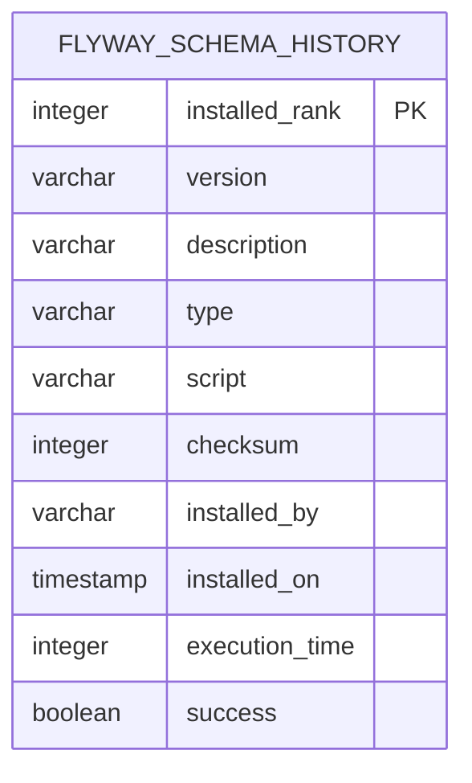

# Database Documentation

**Generated**: 2025-09-05  
**Version**: 1.0.0  
**Database Type**: PostgreSQL 15.14  
**Database Name**: demo_db

## Table of Contents

1. [Database Overview](#database-overview)
2. [Schema Summary](#schema-summary)
3. [Tables Documentation](#tables-documentation)
   - [flyway_schema_history](#flyway_schema_history)
4. [Entity Relationship Diagram](#entity-relationship-diagram)
5. [Data Dictionary](#data-dictionary)
6. [Database Conventions](#database-conventions)
7. [Migration History](#migration-history)
8. [Connection Details](#connection-details)

## Database Overview

### Connection Details
- **Host**: localhost
- **Port**: 5433
- **Database**: demo_db
- **Default Schema**: public
- **Username**: demo_user
- **Version**: PostgreSQL 15.14 on aarch64-unknown-linux-musl, compiled by gcc (Alpine 14.2.0) 14.2.0, 64-bit
- **Container**: PostgreSQL 15 Alpine running in Docker

### Database Characteristics
- **Deployment**: Docker containerized PostgreSQL
- **Migration Tool**: Flyway
- **Character Encoding**: UTF8
- **Timezone**: UTC (default)

## Schema Summary

The database contains the following schemas:

| Schema Name | Owner              | Description                              |
|------------|-------------------|------------------------------------------|
| public     | pg_database_owner | Default schema for application objects  |

## Tables Documentation

### flyway_schema_history

**Purpose**: Tracks database migration history managed by Flyway. This is a system table that maintains the version control of database schema changes.

**Table Structure**:

| Column         | Data Type                    | Nullable | Default | Description                                           |
|---------------|------------------------------|----------|---------|-------------------------------------------------------|
| installed_rank | integer                      | NOT NULL |         | Unique rank/order of the migration                   |
| version       | character varying(50)        | NULL     |         | Version number of the migration                      |
| description   | character varying(200)       | NOT NULL |         | Description of the migration                         |
| type          | character varying(20)        | NOT NULL |         | Type of migration (SQL, JAVA, etc.)                  |
| script        | character varying(1000)      | NOT NULL |         | Script filename or class name                        |
| checksum      | integer                      | NULL     |         | Checksum to detect changes in migration files        |
| installed_by  | character varying(100)       | NOT NULL |         | User who installed the migration                     |
| installed_on  | timestamp without time zone  | NOT NULL | now()   | Timestamp when migration was applied                 |
| execution_time| integer                      | NOT NULL |         | Time taken to execute migration (in milliseconds)    |
| success       | boolean                      | NOT NULL |         | Whether the migration was successful                 |

**Indexes**:
- `flyway_schema_history_pk` (PRIMARY KEY) - btree on `installed_rank`
- `flyway_schema_history_s_idx` - btree on `success`

**Constraints**:
- Primary Key: `flyway_schema_history_pk` on column `installed_rank`

**Storage**: Heap access method

## Entity Relationship Diagram



**Note**: Currently, the database contains only the Flyway schema history table. No application-specific tables have been created yet.

## Data Dictionary

### Complete Column Reference

| Table                 | Column         | Data Type                   | Size | Nullable | Default | Business Description                                      |
|----------------------|---------------|----------------------------|------|----------|---------|----------------------------------------------------------|
| flyway_schema_history | installed_rank | integer                    | 4    | NO       |         | Sequential order of migration execution                  |
| flyway_schema_history | version       | character varying          | 50   | YES      |         | Migration version identifier (e.g., "1.0", "2.1.3")     |
| flyway_schema_history | description   | character varying          | 200  | NO       |         | Human-readable migration description                     |
| flyway_schema_history | type          | character varying          | 20   | NO       |         | Migration type (SQL, JAVA, BASELINE, etc.)              |
| flyway_schema_history | script        | character varying          | 1000 | NO       |         | Full filename or Java class of the migration            |
| flyway_schema_history | checksum      | integer                    | 4    | YES      |         | CRC32 checksum for migration file integrity             |
| flyway_schema_history | installed_by  | character varying          | 100  | NO       |         | Database user who executed the migration                |
| flyway_schema_history | installed_on  | timestamp without time zone| 8    | NO       | now()   | Exact timestamp of migration execution                  |
| flyway_schema_history | execution_time| integer                    | 4    | NO       |         | Duration of migration execution in milliseconds         |
| flyway_schema_history | success       | boolean                    | 1    | NO       |         | Flag indicating if migration completed successfully     |

## Database Conventions

### Naming Patterns
- **Schema**: Using default `public` schema
- **Tables**: Snake_case naming (e.g., `flyway_schema_history`)
- **Columns**: Snake_case naming
- **Indexes**: Pattern `{table_name}_{type}` where type is `pk` for primary key, `idx` for regular index
- **Constraints**: Pattern `{table_name}_{constraint_type}`

### Data Types Used
- **Identifiers**: `integer` for numeric IDs
- **Text Fields**: `character varying` with defined maximum lengths
- **Timestamps**: `timestamp without time zone`
- **Boolean Flags**: `boolean` type
- **Numeric Values**: `integer` for whole numbers

### Default Values
- Timestamp columns use `now()` for automatic timestamp generation

## Migration History

### Current State
No application-specific migrations have been executed yet. The database is in its initial state with only the Flyway schema history tracking table.

### Migration Directory
Location: `/be/src/main/resources/db/migration/`  
Status: Empty (no migration files present)

### Flyway Configuration
- **URL**: jdbc:postgresql://localhost:5433/demo_db?currentSchema=public
- **User**: demo_user
- **Schema**: public
- **Baseline On Migrate**: Default (false)
- **Validate On Migrate**: Default (true)

## Connection Details

### Development Environment (Local Profile)

```yaml
spring:
  datasource:
    url: jdbc:postgresql://localhost:5433/demo_db?currentSchema=public
    username: demo_user
    password: demo_password
```

### JDBC URL Components
- **Protocol**: `jdbc:postgresql://`
- **Host**: `localhost`
- **Port**: `5433` (mapped from container port 5432)
- **Database**: `demo_db`
- **Parameters**: `currentSchema=public`

### Docker Configuration
- **Container Name**: demo-project-postgres
- **Image**: postgres:15-alpine
- **Port Mapping**: 5433:5432
- **Health Check**: Configured and passing

## Notes and Recommendations

### Current Database State
1. The database is currently empty except for Flyway's schema history table
2. No application-specific tables, views, or stored procedures exist
3. Ready for initial migration deployment

### Recommended Next Steps
1. Create initial Flyway migration scripts in `/be/src/main/resources/db/migration/`
2. Follow naming convention: `V{version}__{description}.sql` (e.g., `V1.0__Create_initial_schema.sql`)
3. Consider creating base tables for:
   - User management
   - Application configuration
   - Core business entities

### Security Considerations
1. Current setup uses plain text passwords in configuration (suitable for local development only)
2. For production, implement:
   - Encrypted passwords
   - Environment variable injection
   - Vault or secret management system
   - Read-only user for application runtime
   - Separate migration user with DDL permissions

### Performance Considerations
1. Currently only basic indexes exist (primary keys and success flag index)
2. As tables are added, consider:
   - Adding indexes on foreign key columns
   - Creating indexes for frequently queried columns
   - Implementing partitioning for large tables
   - Regular VACUUM and ANALYZE schedules

---
*This documentation represents the current state of the database. As the schema evolves through migrations, this document should be updated to reflect the changes.*